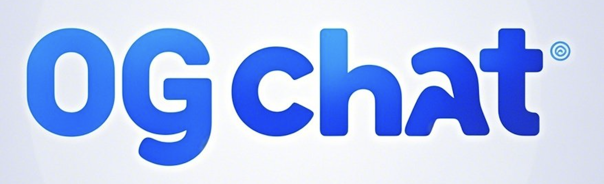

# 0GChat - Decentralized Workplace Communication Platform



## Introduction

0GChat is a revolutionary decentralized communication and productivity platform built on the 0G blockchain. Designed for modern workplace collaboration, it combines secure messaging, automatic translation, and AI-powered productivity tools in a blockchain-native environment.

## Getting Started

This project was bootstrapped with [Create React App](https://github.com/facebook/create-react-app).

### Prerequisites
- Node.js (v14 or later)
- npm or yarn
- Web3 wallet (MetaMask, WalletConnect, etc.)

### Installation

1. Clone the repository:
   ```bash
   git clone https://github.com/your-repo/0gchat.git
   cd 0gchat
   ```

2. Install dependencies:
   ```bash
   npm install
   ```

3. Configure environment variables:
   Create a `.env` file based on `.env.example` and add your configuration.

## Available Scripts

In the project directory, you can run:

### `npm start`
Runs the app in development mode.\
Open [http://localhost:3000](http://localhost:3000) to view it in your browser.

### `npm test`
Launches the test runner in interactive watch mode.

### `npm run build`
Builds the app for production to the `build` folder.

### `npm run eject`
**Note: this is a one-way operation.** Ejects from Create React App configuration.

## Key Features

### 🚀 Wallet-Based Authentication
- Passwordless login using Web3 wallets
- Simple onboarding with username and language selection

### 🌍 Decentralized Messaging with Auto-Translation
- Add contacts by wallet address
- Real-time message translation between languages
- End-to-end encrypted communications

### 🤖 AI-Powered Productivity
- Automated work report generation from chat history
- Task tracking and priority management
- Smart reminders and follow-up suggestions

### ⛓ Blockchain Native
- Built on 0G's decentralized storage and computation
- Transparent billing with $A0GI token payments
- All transactions recorded on-chain

## Technical Architecture

- **Frontend**: React.js with Web3 integration
- **Blockchain**: 0G network for decentralized operations
- **AI Services**: Hybrid model combining fine-tuned internal knowledge with RAG
- **Storage**: Decentralized storage for messages and user data

## Future Roadmap

We're working on implementing our Internal Intelligence System:
1. Gather HR documents and department responsibilities
2. Collect historical task records from internal platforms
3. Incorporate employee capability data
4. Fine-tune lightweight models using 0G's infrastructure
5. Deploy hybrid AI system (70% fine-tuned model, 30% RAG)

## Contributing

We welcome contributions! Please fork the repository and create a pull request with your changes.

## Support & Contact

Have questions or want to get involved?
- Telegram: [@EugeneWill](https://t.me/EugeneWill)
- Twitter: [@_CryptoSift](https://twitter.com/_CryptoSift)

## License

This project is licensed under the MIT License - see the [LICENSE](LICENSE) file for details.

---

*Replace logo path and customize links as needed for your actual project*